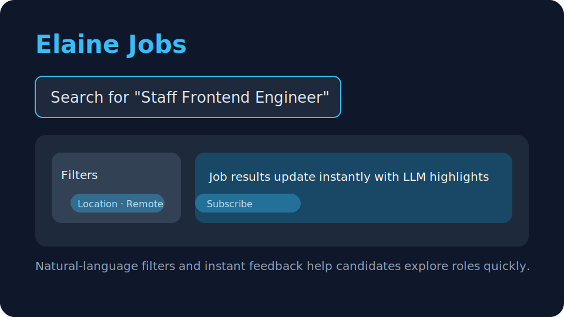
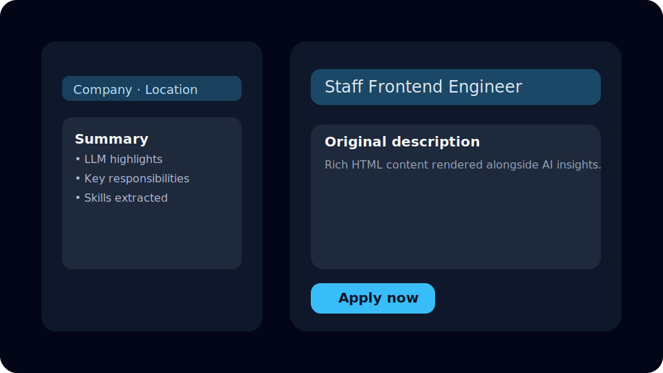
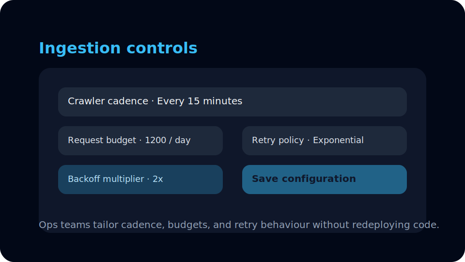
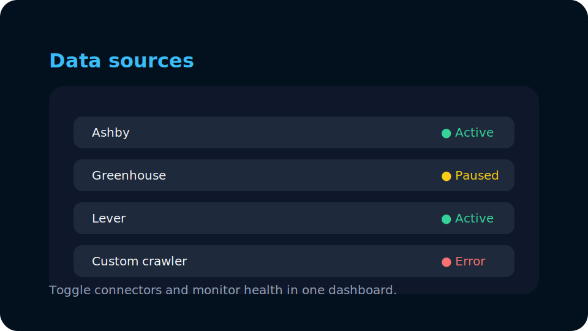

# Elaine Jobs · vibecoding-jobsearch

[Read this in English 🇺🇸](README.md)

Elaine Jobs 是一个面向国内用户的外企职位情报系统，通过统一的抓取管线和 LLM 加持的内容增强，提供近实时、可检索、可订阅的招聘信息聚合服务。


## 产品巡礼

> _说明：以下为基于界面重绘的矢量示意图，方便在不提交二进制资源的情况下展示核心流程。_

<p align="center">
  
</p>

- **搜索体验** —— 首页提供自然语言检索、快速标签（地点、职位类型、技术栈）以及即时结果，帮助候选人快速发现合适的岗位。
- **职位详情** —— AI 生成的高亮摘要与结构化元数据，与原始职位描述同屏展示，便于候选人快速判断是否匹配。

<p align="center">
  
</p>

- **采集控制** —— 运营同学可在后台直接配置抓取频率、预算与重试策略，以满足不同业务诉求。

<p align="center">
  
</p>

- **数据源管理** —— 一键启用 / 暂停 ATS 连接器或自定义爬虫，并实时查看当前状态，确保职位信息持续更新。
- **爬虫蓝图自动生成** —— 在后台向导中输入入口 URL、关键词或忽略选择器，后端会调用 Playwright 自动分析网页结构，产出蓝图草稿和验证报告，审核通过后即可注册数据源。

<p align="center">
  
</p>


## 目录
- [系统总览](#系统总览)
- [架构与核心组件](#架构与核心组件)
- [数据采集与处理流程](#数据采集与处理流程)
- [LLM 增强链路](#llm-增强链路)
- [前后端协同](#前后端协同)
- [技术栈一览](#技术栈一览)
- [部署与运维](#部署与运维)
- [本地开发指南](#本地开发指南)
- [仓库结构](#仓库结构)
- [路线图](#路线图)

## 系统总览
- **目标用户**：希望在国内快速获取外企职位信息的人群，无需梯子即可访问。
- **核心价值**：聚合各类 ATS（Applicant Tracking System）与官方 Career Page 数据源，统一建模、清洗与打分后输出标准化的职位数据，并通过 LLM 提取摘要、亮点与技能标签。
- **线上环境**：https://elainejobs.com/ （部署于 AWS EC2，数据库使用 Amazon Aurora MySQL 8.0 兼容版）。

## 架构与核心组件
| 分层 | 说明 | 关键目录 |
| --- | --- | --- |
| 展示层 | Next.js 前端应用，提供搜索、浏览、订阅和后台管理界面。 | [`vibe-jobs-view/`](./vibe-jobs-view) |
| 业务层 | Spring Boot 后端服务，负责数据抓取、调度、持久化、搜索 API 与后台配置。 | [`vibe-jobs-aggregator/`](./vibe-jobs-aggregator) |
| 数据层 | MySQL（Aurora 兼容），通过 Flyway 管理 schema；缓存和任务调度由服务自身处理。 | `Aurora / RDS` |
| 边缘层 | Caddy 反向代理与 Docker Compose 部署，暴露统一域名和反向路由。 | [`Caddyfile`](./Caddyfile)、[`docker-compose.yml`](./docker-compose.yml)、[`docker/`](./docker) |

## 数据采集与处理流程
1. **数据源配置**
   - 支持主流 ATS：`ashby`、`greenhouse`、`lever`、`recruitee`、`smartrecruiters`、`workday` 等。
   - 后台可动态启用/禁用数据源、切换模式（增量 / 指定公司）、配置分页大小、并发度、初始延迟等调度参数。
   - 新增的爬虫蓝图生成向导支持运营输入入口 URL、搜索关键词与排除选择器，由后端 Playwright 运行自动生成草稿 JSON 与验证报告，方便快速上线新站点。
2. **任务调度**
   - 使用 Spring 调度器按配置触发抓取任务，支持固定延迟与指定起始时间。
   - 每个任务会根据模式生成待抓取的公司列表或增量游标，以减少重复请求。
3. **抓取策略**
   - **HTTP / API 优先**：对接各数据源公开 API 或 JSON 接口。
   - **动态页面兜底**：对需要渲染的页面可切换到 Playwright，实现 Headless 浏览器抓取。
4. **解析与标准化**
   - Jsoup / JSON 解析器将原始响应转换为统一的 `Job` 模型（包含职位基本信息、地点、薪资、标签等字段）。
   - 通过去重策略（外部 ID + 内容指纹）确保同一职位只保留一次。
5. **详情补充**
   - 对列表信息进行补充抓取（详情页、富文本内容），结果存储在 `job_details` 表，并为 LLM 增强提供输入。
6. **持久化与索引**
   - 利用 Spring Data JPA 将职位数据写入 MySQL，Flyway 负责 schema 迁移。
   - 对关键字段（公司、地点、标签）建索引，提升查询性能。

## LLM 增强链路
1. **触发时机**：职位详情更新后，通过领域事件发布 `JobDetailContentUpdatedEvent`。
2. **异步调用**：事件监听器在事务提交后调用 `JobContentEnrichmentClient`，向外部 LLM 服务（可配置，如 OpenAI）请求摘要、技能、亮点等结构化信息。
3. **结构化存储**：LLM 返回的结果以 `JobDetailEnrichment` 形式写入数据库，采用通用 `key-value` + JSON 模型（例如 `summary`、`skills`、`highlights`、`status`）。
4. **幂等与版本控制**：保存前校验 `contentVersion` 与 `sourceFingerprint`，避免旧内容覆盖新结果；失败时记录状态并支持重试。
5. **前端消费**：API 将 `enrichments` 字段下发给前端，根据 `status` 渲染摘要、亮点或降级到原始详情。

## 前后端协同
- **搜索与过滤**：前端通过 `/backend-api/jobs/search`（示例路径）向后端发起检索，支持关键词、地点、公司等条件。
- **职位详情**：前端在详情页调用 `/backend-api/jobs/{id}/detail`，展示 LLM 生成的摘要与原始富文本。
- **订阅能力**：用户可基于检索条件提交订阅请求（`/backend-api/subscriptions`），后端通过邮件服务触达（待完善）。
- **后台管理**：管理端使用相同的 API，提供调度参数、数据源列表、任务状态与抓取日志查看能力。

## 技术栈一览
- **前端**：Next.js (App Router) · TypeScript · React · TailwindCSS · Zustand · SWR。
- **后端**：Spring Boot 3 · Java 17 · Spring WebFlux & WebMVC · Spring Data JPA · Flyway · Jackson · Jsoup · Playwright。
- **基础设施**：Docker · Docker Compose · Caddy · AWS EC2 · Amazon Aurora (MySQL 8.0)。
- **辅助工具**：Maven Wrapper · PNPM · GitHub Actions（可选 CI/CD）。

## 部署与运维
- **CI/CD 自动化**：前后端均采用 GitHub Actions 实现持续集成与持续部署。每次提交或合并 PR 后，自动触发构建、测试及部署流程。相关配置文件见 [.github/workflows/](./.github/workflows/) 目录。
- **容器化**：通过 [`docker-compose.yml`](./docker-compose.yml) 编排前端、后端与 Caddy；`docker/` 目录存放各组件的 Dockerfile。
- **反向代理**：Caddy 将 `/backend-api/*` 转发至后端 8080 端口，将 `/api/*` 转发至前端 3000 端口，并暴露 Swagger / Actuator 接口。
- **数据库迁移**：后端启动时自动执行 Flyway，确保 schema 与代码保持一致。
- **监控与节流**：调度面板可配置并发度与重试；建议根据目标站点设置合理节流策略，遵守 robots.txt 与服务条款。

## 本地开发指南
### 后端
```bash
cd vibe-jobs-aggregator
./mvnw spring-boot:run
```
需准备 MySQL 8.0（或使用 H2）并配置环境变量：
- `SPRING_DATASOURCE_URL=jdbc:mysql://localhost:3306/elaine_jobs?useSSL=false&serverTimezone=UTC`
- `SPRING_DATASOURCE_USERNAME=...`
- `SPRING_DATASOURCE_PASSWORD=...`

### 前端
```bash
cd vibe-jobs-view
pnpm install
NEXT_PUBLIC_BACKEND_BASE=http://localhost:8080 pnpm dev
```

## 仓库结构
```
.
├── Caddyfile                    # 反向代理与路由规则
├── docker-compose.yml           # 前后端 + Caddy 容器编排
├── docker/                      # 各服务的 Dockerfile 与部署脚本
├── deploy.sh                    # 示例部署脚本
├── vibe-jobs-aggregator/        # 后端：Spring Boot + 数据采集 + LLM 集成
│   ├── pom.xml
│   └── src/...
└── vibe-jobs-view/              # 前端：Next.js (App Router)
    └── app/page.tsx
```

## 路线图
- [ ] 丰富 ATS 连接器与官方 Career Page 的覆盖范围。
- [ ] 引入语义检索 / 嵌入向量搜索，提升职位匹配体验。
- [ ] 完善订阅与通知体系（邮件、消息推送、Webhook）。
- [ ] 建立抓取监控与告警体系，包含失败率、速率限制、LLM 调用指标等。
