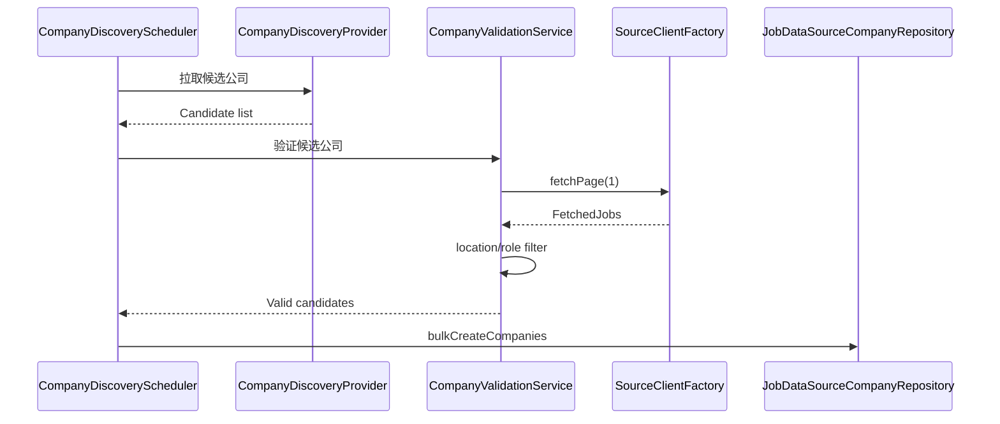

# 🧭 数据源公司自动发现与补全方案设计（版本 1）

## 📌 文档信息
| 字段 | 内容         |
| --- |------------|
| 负责人 | peng       |
| 审核人 | peng       |
| 状态 | 草案         |
| 最近更新 | 2026-01-29 |

## 1. 背景与目标
目前公司列表维护完全依赖人工（先在外部搜索再手动录入），效率低且难以规模化。

### 1.1 目标
- **例行自动补充**新的公司到 `job_data_source_company`。
- 仅处理 **`job_data_source` 中 `enabled = true` 且 `type != crawler`** 的数据源。
- **通过脚本调接口验证**：确保能拉到真实岗位数据后再入库。
- 覆盖 **APAC 地域**、且岗位包含 **engineer / financial analyst**（可配置），并优先筛选外企。
- **不影响现有功能**，且可配置、可扩展。
- **调度配置**可在 Admin 后台实时修改并生效。
- **新公司列表**可在 Admin 后台查看与审计。

### 1.2 非目标
- 替代现有后台人工维护流程。
- 为 `crawler` 类型数据源做公司发现（版本 1 排除）。
- 构建全新采集引擎（复用现有 SourceClient + filter）。

---

## 2. 业务流程概览
1. **加载数据源**：读取 `job_data_source` 中 `enabled = true` 且 `type != crawler` 的数据源。
2. **发现候选公司**：通过可配置 Provider 拉取潜在公司列表。
3. **验证候选公司**：使用已有 `SourceClientFactory` 实际请求拉取岗位（至少一页）。
4. **过滤岗位**：复用现有 Location/Role 过滤器，确保 APAC + 目标岗位命中。
5. **持久化入库**：仅将校验通过且未存在的公司写入 `job_data_source_company`。
6. **记录结果**：保存运行日志、成功/失败原因与统计。
7. **后台可视化**：Admin 后台支持查看运行记录与本次新增公司列表。



---

## 3. 约束与规则
- 仅处理 `enabled = true` 且 `type != crawler` 的数据源。
- 不硬编码，全部通过配置驱动。
- 不影响现有 ingestion / admin 功能。
- 领域层不依赖 Spring/JPA；持久化通过 `domain.spi` 端口。
- 所有 DDL/DML 必须可重复执行，新增表必须包含 `create_time`, `update_time`, `deleted` 字段。

---

## 4. 模块架构设计（DDD）
新增上下文：`companydiscovery`，结构：

```
com.vibe.jobs.companydiscovery
  domain/
    CompanyDiscoveryRun
    CompanyCandidate
    CompanyDiscoveryRule
    CompanyDiscoveryResult
    spi/
      CompanyDiscoveryProviderPort
      CompanyDiscoveryRunRepositoryPort
  application/
    CompanyDiscoveryService
    CompanyDiscoveryScheduler
    CompanyValidationService
    CompanyDiscoverySettingsService
  infrastructure/
    provider/
      GreenhouseCompanyDiscoveryAdapter
      LeverCompanyDiscoveryAdapter
      SmartRecruitersCompanyDiscoveryAdapter
      WorkdayCompanyDiscoveryAdapter
    jpa/
      CompanyDiscoveryRunEntity
      CompanyDiscoveryRunRepositoryAdapter
  interfaces/
    rest/
      CompanyDiscoveryAdminController
      dto/
```

---

## 5. 发现数据源（Provider 策略）
### 5.1 发现目标
“新的公司需要你自己探索” → 版本 1 采用**公开 API / Job Board 目录**作为数据源。

### 5.2 候选 Provider 列表（可配置）
| Provider | 目标来源 | 说明 |
| --- | --- | --- |
| Greenhouse | Public Job Board API | 支持基于 `boards-api.greenhouse.io` 访问公司招聘数据。 |
| Lever | Lever Postings API | 支持 `api.lever.co/v0/postings/{company}`。 |
| SmartRecruiters | SmartRecruiters Public API | 支持基于 `companyIdentifier` 获取职位列表。 |
| Workday | Workday tenant job API | 需公司 `tenant`/`site` 组合。 |

### 5.3 公司发现策略
- **目录型 API**：从公共聚合或可公开的 ATS 目录获取公司列表。
- **种子扩展**：从配置的 seed 公司列表出发，延伸获取关联公司（如同集团公司）。
- **黑白名单**：支持 `include`/`exclude` 列表，避免低质量/重复公司。

---

## 6. 验证逻辑（确保真实数据）
### 6.1 验证流程
1. 根据候选公司 + 数据源类型，构建 `SourceClient` 选项。
2. 调用 `SourceClient.fetchPage(1, pageSize)` 拉取岗位。
3. 使用现有过滤器：
   - **LocationFilterService**：确保 APAC 匹配。
   - **RoleFilterService**：包含 `engineer` / `financial analyst`（可配置）。
4. 过滤后仍有岗位 → **验证通过**，可入库。

### 6.2 复用现有过滤器
- LocationFilter 与 RoleFilter 已存在配置模型，可直接复用。
- 仅扩展配置项（如 `company-discovery.roleFilter` / `company-discovery.locationFilter`）与 ingestion 同结构。

---

## 7. 数据持久化设计
### 7.1 目标表
- `job_data_source_company`
  - 新增公司时必须校验 `(data_source_code, reference, deleted=false)` 唯一。
  - 通过 `AdminDataSourceService.bulkCreateCompanies` 复用已有校验逻辑。

### 7.2 运行记录表（建议新增）
#### `company_discovery_run`
- `id`
- `provider`
- `started_at`
- `completed_at`
- `status` (PENDING / RUNNING / SUCCESS / FAILED)
- `total_candidates`
- `total_valid`
- `create_time`
- `update_time`
- `deleted`

#### `company_discovery_result`
- `id`
- `run_id`
- `data_source_code`
- `company_reference`
- `validation_status`
- `reason`
- `metadata`
- `create_time`
- `update_time`
- `deleted`

---

## 8. 调度与配置
### 8.1 Scheduler
- 新增 `CompanyDiscoveryScheduler`，独立于 ingestion 调度。
- 默认 `enabled=false`，避免影响现有功能。
- 支持：
  - `fixedDelayMs`
  - `initialDelayMs`
  - `pageSize`（候选公司验证拉取的职位页大小）
  - `maxCandidatesPerRun`
  - `dryRun`（默认 true）

### 8.2 Admin 后台可视化配置
- 新增 **Company Discovery 设置页**，支持实时修改与即时生效：
  - 全局开关（enabled）
  - 调度参数（fixedDelayMs / initialDelayMs）
  - provider 选择与 seed 列表
  - 过滤器配置（APAC / 目标岗位关键词）
  - dry-run 模式
- 修改后触发配置变更事件，调度器实时刷新（参考现有 ingestion settings 模式）。

### 8.3 配置示例
```yaml
company-discovery:
  enabled: false
  initialDelayMs: 10000
  fixedDelayMs: 86400000
  pageSize: 50
  maxCandidatesPerRun: 200
  dryRun: true
  includeDataSourceTypes: [greenhouse, lever, smartrecruiters, workday, standard]
  excludeCompanies: ["example-inc"]
  provider:
    greenhouse:
      enabled: true
      seedCompanies: ["stripe", "airbnb"]
    lever:
      enabled: true
      seedCompanies: ["canva", "asana"]
  locationFilter:
    enabled: true
    includeCountries: ["singapore", "japan", "australia", "hong kong"]
  roleFilter:
    enabled: true
    includeKeywords: ["engineer", "financial analyst"]
```

---

## 9. Admin 后台展示
### 9.1 运行记录页面
- 列表展示：运行时间、provider、成功/失败、候选数量、验证通过数量。
- 支持按时间范围、provider、状态过滤。

### 9.2 新公司列表页面
- 展示每次运行新增公司记录：
  - data_source_code
  - company_reference
  - validation_status
  - 发现来源（provider）
  - 时间戳
- 支持导出 CSV/Excel（可选）。

---

## 10. 对外接口（可选）
- `POST /admin/company-discovery/run`：触发一次运行
- `GET /admin/company-discovery/runs`：查询运行记录
- `GET /admin/company-discovery/runs/{id}`：查看详细结果
- `GET /admin/company-discovery/results`：查看新增公司记录列表
- `PUT /admin/company-discovery/settings`：更新调度与过滤配置

---

## 11. 风险与缓解
| 风险 | 影响 | 缓解措施 |
| --- | --- | --- |
| Provider API 变化或限流 | 运行失败 | 配置化切换 provider，支持重试与限速 |
| 误判导致低质量公司入库 | 数据污染 | 真实岗位验证 + 过滤器 + dry-run |
| 过多请求影响目标站点 | 法务/技术风险 | 限速与每日候选上限 |

---

## 12. 里程碑（版本 1）
1. **M1：调度 + 配置 + dry-run**（1 周）
2. **M2：完成 2 个 Provider（Greenhouse/Lever）**（1-2 周）
3. **M3：验证 + 入库 + 运行记录**（1 周）
4. **M4：扩展 Provider（SmartRecruiters/Workday）**（持续迭代）

---

## 13. 结论
版本 1 方案通过引入独立的 Company Discovery 模块，复用现有数据源配置、过滤器与 SourceClient 验证流程，在**不影响现有功能**的前提下，实现自动发现 + 验证 + 入库的闭环，并具备可扩展、可配置、可审计的能力。同时补充 Admin 后台实时配置与新公司结果可视化，方便运营干预与审计。
