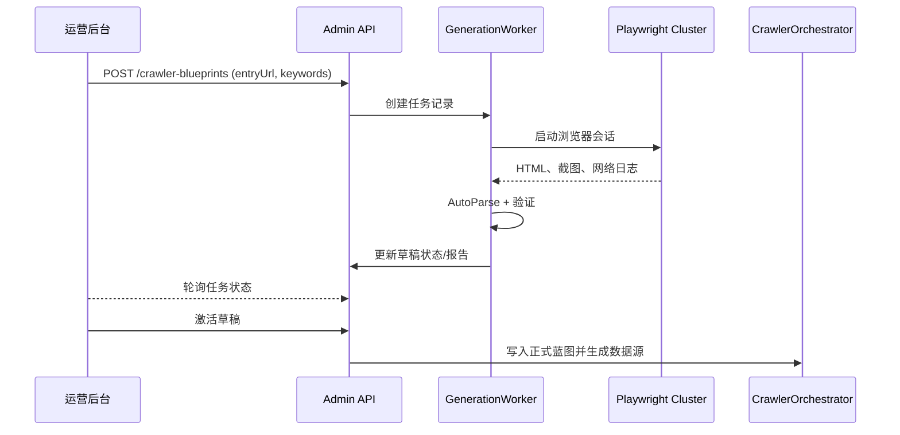

# 🧭 自动化爬虫蓝图生成方案设计（方案一）

## 📌 文档信息
| 字段 | 内容 |
| --- | --- |
| 负责人 | 数据采集工程组 |
| 审核人 | Playwright 基础设施负责人 |
| 状态 | 草案 |
| 最近更新 | 2024-05-09 |

## 1. 背景与目标
当前系统已内置 Playwright 自动化引擎和标准化的爬虫执行框架（`CrawlerOrchestrator` + `CrawlerParserEngine`），但蓝图配置完全依赖人工维护，导致配置门槛高、周期长、质量难以保障。

### 1.1 目标
- 为运营后台提供“爬虫蓝图向导”，让运营人员通过页面输入入口 URL、关键词等信息，由系统自动生成爬虫蓝图草稿。
- 后台自动触发 Playwright 测试与解析推断，生成可工作的 `crawler_blueprint` 配置，并提供验证报告。
- 支持草稿 → 验证 → 发布的闭环，最终自动生成对应的数据源，降低人工介入成本。

### 1.2 非目标
- 替代所有人工配置：复杂场景仍需运营手动微调。
- 构建新的调度或分发系统：沿用现有调度框架，仅新增蓝图生成能力。

### 1.3 成功指标
| 指标 | 目标 |
| --- | --- |
| 单个蓝图生成耗时 | ≤ 10 分钟（含 Playwright 验证） |
| 自动解析覆盖率 | 70% 列表页字段正确识别 |
| 运营介入时间 | 相比人工配置下降 60% |
| 失败任务可重试率 | 100%（不依赖重建任务） |

## 2. 业务流程概览
1. 运营在管理端输入入口 URL、搜索关键词及可选辅助信息（登录信息、忽略选择器等），提交生成任务。
2. 后端创建蓝图草稿记录，异步调用 Playwright 采集列表页与详情页 HTML，并归档截图、日志。
3. `CrawlerBlueprintAutoParser` 根据 HTML 推断列表选择器、字段映射、分页策略等，生成 `draft_config_json`。
4. 系统在沙箱模式下执行一次完整抓取，生成测试报告、样例数据，更新草稿状态为 READY/FAILED。
5. 运营在后台查看草稿详情，必要时微调配置，确认后发布蓝图并自动创建数据源。
6. 后续可在同一页面重新触发验证、复制为新蓝图、导出 JSON 等操作。

## 3. 需求与约束
- **并发约束**：单节点最多同时运行 3 个 Playwright 实例，避免资源争用。
- **兼容性**：蓝图结构需与现有 `CrawlerOrchestrator` 完全兼容，可直接交由调度执行。
- **可观测性**：生成任务必须产出日志、截图、样例数据，供运营审阅。
- **安全要求**：登录凭据、Cookie 等敏感信息需加密存储并限制可见范围。

## 4. 数据建模与存储
### 4.1 表结构扩展
- `crawler_blueprint`
  - 新增字段：`status ENUM('DRAFT','READY','ACTIVE','FAILED')`、`draft_config_json JSON`、`last_test_report JSON`、`auto_generated BOOLEAN`、`generated_by VARCHAR`、`generated_at TIMESTAMP`
- 新建 `crawler_blueprint_generation_task`
  - 字段：`id`、`blueprint_code`、`input_payload`、`status ENUM('PENDING','RUNNING','SUCCEEDED','FAILED')`、`started_at`、`finished_at`、`error_message`、`browser_session_snapshot`、`sample_data`
  - 标准字段：`create_time TIMESTAMP NOT NULL`、`update_time TIMESTAMP NOT NULL`、`deleted BOOLEAN NOT NULL DEFAULT FALSE`
- `job_data_source`
  - 新增字段：`crawler_blueprint_code`、`auto_generated`
  - 所有 DDL/DML 变更需以 `resources/db.migrations` 中 `V<序号>_<description>_<ddl|dml>.sql` 命名的可重复执行脚本交付

### 4.2 存储策略
- Playwright 快照、日志、HTML、截图存储在对象存储（MinIO/S3），数据库仅保存路径与摘要信息。
- 引入定期清理任务，清理超过 N 天的失败草稿与体积过大的快照，防止存储膨胀。

## 5. 后端服务设计
### 5.1 控制层（Admin API）
- `POST /admin/crawler-blueprints`
  - 入参：`entryUrl`、`searchKeywords`、`authentication`、`excludeSelectors`、`notes`
  - 行为：创建草稿记录，生成异步任务 ID，返回任务状态。
- `GET /admin/crawler-blueprints/{code}`
  - 返回草稿详情、当前状态、草稿配置、测试报告、样例数据、日志链接。
- `POST /admin/crawler-blueprints/{code}/rerun`
  - 重新触发 Playwright 验证流程。
- `POST /admin/crawler-blueprints/{code}/activate`
  - 校验草稿状态为 READY，持久化为正式蓝图，创建/更新对应数据源。
- `GET /admin/crawler-blueprints`
  - 支持按状态、创建人、时间过滤，分页返回列表。

控制层统一复用现有鉴权、限流与审计日志能力。

### 5.2 应用层服务
- `CrawlerBlueprintGenerationService`
  - Orchestrate 全流程：保存输入、触发 Playwright、解析推断、测试验证、状态回写。
  - 支持配置最大并发、超时时间、重试次数。
- `CrawlerBlueprintAutoParser`
  - 输入：列表 HTML、详情 HTML；输出：结构化解析配置（字段 CSS、分页策略、自动化步骤）。
  - 算法：DOM 聚类寻找重复块 → 关键词打分识别字段 → 分页策略探测（按钮、URL query 或滚动加载）。
- `CrawlerBlueprintValidator`
  - 通过沙箱模式执行采集，校验字段完整度、反爬风险，生成测试报告。
- `PlaywrightSessionManager`
  - 管理浏览器池、Session 生命周期、错误截图、网络日志捕获；复用现有 `BrowserSessionManager` 并为生成任务提供独立队列。

### 5.3 异步任务执行
- 采用现有消息队列或 `@Async` + 任务表轮询实现 Playwright 执行异步化。
- `GenerationWorker`
  - 流程：`prepareSession → navigate → collectHtml → autoParse → validate → persist`
  - 失败时写入 `error_message`、`failure_snapshot`，状态置为 FAILED，支持人工重试。

## 6. Playwright 自动化流程
1. **Session 初始化**：根据入参准备 User-Agent、代理、登录脚本（如需要），注入页面等待策略（`waitForLoadState('networkidle')`）。
2. **表单填充 & 触发搜索**：若提供 `searchKeywords`，自动定位输入框并填入关键词，点击搜索按钮，通过语义/位置匹配定位元素。
3. **滚动与分页探索**：执行预设滚动脚本收集懒加载内容，探测分页按钮/滚动加载模式并记录 URL 或 DOM 变化。
4. **数据采集**：保存列表页 HTML、主要节点截图、网络请求日志；对前 N 条详情链接逐一打开，采集详情页 HTML 与截图。
5. **异常处理**：触发登录/验证码时记录错误类型与建议；超时或 DOM 结构不稳定时，按策略重试并降级保存部分内容。

## 7. 蓝图生成与验证
1. `CrawlerBlueprintAutoParser` 将列表 HTML 分析为：
   - `entryUrl`
   - `listSelector`
   - 字段解析配置（标题、公司、地点、薪资、链接、发布时间等）
   - 分页配置（下一页按钮选择器、URL 参数增量、滚动策略）
   - 自动化设置（滚动次数、等待时长）
   - 详情页解析配置（正文容器选择器、等待策略）
2. 生成 `draft_config_json` 并写入 `crawler_blueprint` 草稿记录。
3. 使用 `CrawlerOrchestrator` 在沙箱模式执行一次采集：
   - 限制请求数并阻止写数据库，仅生成测试数据。
   - 验证字段完整度（缺失率、重复率）与数据质量评分。
   - 输出 `last_test_report`，包含字段统计、样例 JSON 数据、运行日志、请求数、耗时、截图/HTML 下载链接。
4. 验证成功则状态置为 READY；失败则置为 FAILED，并在报告中附带错误详情及建议。

## 8. 管理端前端设计
### 8.1 页面结构
- **列表页**：展示所有蓝图任务，包含状态、入口 URL、创建人、生成耗时、最新报告入口。
- **创建向导页**：表单字段包含入口 URL、搜索关键词、登录信息/脚本、忽略选择器、备注；提交后实时展示任务状态卡片（轮询 `generation_task`）。
- **详情页**：展示基础信息、蓝图结构化视图（流程图、JSON 视图、字段映射）、测试报告（样例数据、字段统计、截图下载）、操作按钮（重新验证、编辑草稿、发布蓝图）。

### 8.2 交互细节
- 轮询任务状态：每 5 秒调用 `GET /generation-tasks/{id}`。
- 失败任务提供错误提示、日志、截图链接，支持直接重新触发。
- 成功任务支持导出 JSON、复制草稿、跳转到对应数据源。

## 9. 数据源发布流程
1. 运营点击“发布蓝图”，前端调用 `POST /admin/crawler-blueprints/{code}/activate`。
2. 后端校验状态为 READY，写入正式蓝图配置（`status=ACTIVE`），并触发：
   - 在 `job_data_source` 中创建/更新记录，设置 `crawler_blueprint_code`、默认调度配置、`auto_generated=true`。
   - 写入审计日志。
3. 返回数据源 ID，前端跳转数据源详情，继续配置公司维度映射、调度频率等。

## 10. 可观察性、运维与风控
- Prometheus 增加 Playwright 任务指标（启动次数、成功率、平均耗时），并配置报警策略（失败率、超时阈值）。
- 管理端展示最近 10 次任务历史，支持下载执行日志。
- 定期任务清理超过 30 天的 `FAILED` 草稿与临时快照。
- 操作均需后台权限控制并写入审计日志。
- 设置 Playwright 任务最大并发与速率限制，防止对目标网站产生过大压力。
- 登录凭据等敏感信息加密存储，仅在任务执行时解密；外部链接执行黑名单过滤防止恶意脚本。

## 11. 风险与缓解
| 风险 | 影响 | 缓解措施 |
| --- | --- | --- |
| 页面结构高度动态导致解析失败 | 生成草稿失败 | 提供运营自定义选择器入口，并在报告中给出建议 |
| Playwright 资源不足 | 任务排队时间长 | 引入任务队列优先级，峰值时动态扩容执行节点 |
| 自动生成配置不符合上线要求 | 数据质量下降 | 默认状态为草稿，需运营审核后再发布；提供样例数据与报告 |
| 目标站点反爬策略升级 | 任务失败率上升 | 记录详细日志，支持快速切换代理/IP，必要时回退人工流程 |

## 12. 推进计划（里程碑）
1. **Milestone 1：基础闭环（2 周）**
   - 打通入口 URL → Playwright 抓取 → HTML 存档基础链路。
   - 后台页面提交任务并查看执行日志。
2. **Milestone 2：自动解析与验证（3 周）**
   - 实现 `CrawlerBlueprintAutoParser`、`CrawlerBlueprintValidator`，输出结构化草稿与测试报告。
3. **Milestone 3：发布与生态融合（2 周）**
   - 激活蓝图、自动创建数据源，集成监控、审计、清理策略。
4. **Milestone 4：优化与扩展（持续迭代）**
   - 引入机器学习提升解析准确度，支持更复杂的自动化脚本（多步骤登录、文件下载等）。

## 13. 结论
该方案在现有 Playwright 自动化与 `CrawlerOrchestrator` 基础上扩展最少量的服务与数据结构即可落地。通过标准化的任务执行、解析验证与运营审核流程，可显著降低蓝图配置成本并提升数据质量，为后续自动扩展更多站点奠定基础。
