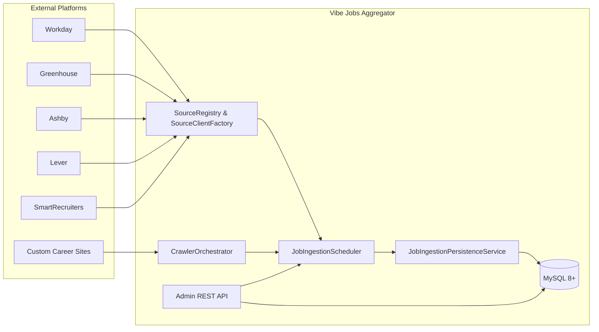
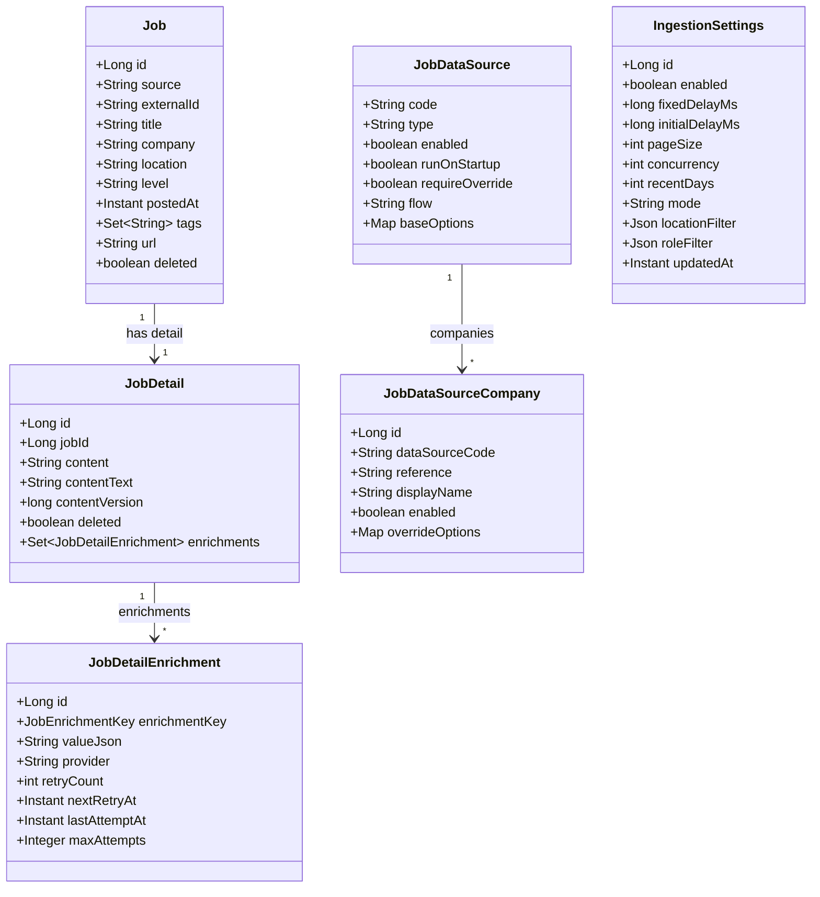
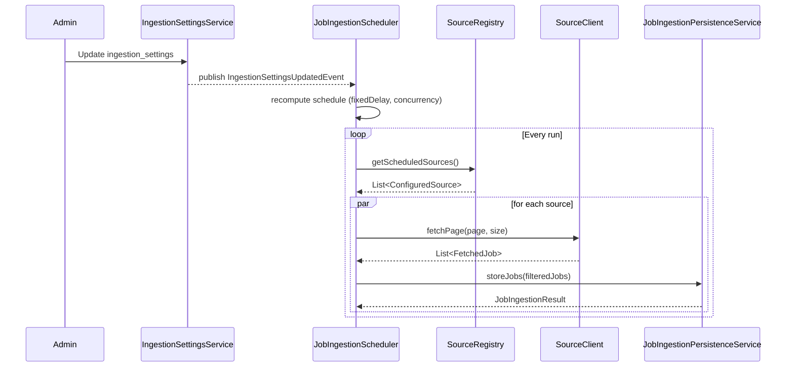
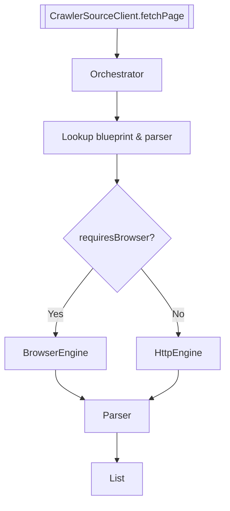

# Vibe Jobs Aggregator

Backend service (Spring Boot 3 / Java 17) that centralises job postings from multiple external platforms, enriches them, and exposes the data to downstream consumers and the admin portal. This document provides a high-level technical overview of the codebase, focusing on the domain model, ingestion pipeline, and operational tooling.

---

## 1. Architecture Overview



The ingestion loop is driven by `JobIngestionScheduler`, which fetches source definitions from the database, resolves the appropriate client (REST API or browser-based crawler), retrieves pages of jobs, filters/enriches the results, and persists them into the `jobs` / `job_details` domain tables. The admin UI interacts with the same APIs (proxied through Next.js) to manage configuration, trigger manual runs, and inspect results.

---

## 2. Core Data Model



### Table highlights

| Table | Purpose |
| ----- | ------- |
| `jobs` | Canonical list of job postings grouped by `company` + `externalId`. Includes high-level metadata, tags, and soft-delete flag. |
| `job_details` | Raw HTML + text content for a posting, including `contentVersion` for optimistic locking. |
| `job_detail_enrichments` | Enrichment snapshots (summary, skills, highlights, structured data, status). Tracks retry scheduling (`retryCount`, `nextRetryAt`, `maxAttempts`). |
| `job_data_source` | Master configuration for each provider (Workday, Greenhouse, crawler blueprint, …). |
| `job_data_source_company` | Per-provider company list (slug + display name + overrides). |
| `ingestion_settings` | Global ingestion cadence, filters, and runtime toggles. Stored as JSON columns to simplify rollouts. |
| `crawler_*` | Blueprint configuration, parser templates, run logs, and cache for browser-driven scraping. |

`IngestionSettingsService` loads the active record, providing the scheduler with runtime parameters (delay, concurrency, location and role filters, etc.). Admin mutations update this table without restarting the service.

---

## 3. Configuration

### 3.1 Ingestion Settings (`ingestion_settings`)

```
ingestion_settings
└─ enabled             // toggles scheduler globally
└─ fixed_delay_ms      // delay between runs
└─ initial_delay_ms    // startup offset
└─ page_size           // max jobs per fetch
└─ concurrency         // concurrent source batches
└─ mode                // companies | recent
└─ recent_days         // used when mode=recent
└─ location_filter     // JSON (include/exclude countries/regions/cities/keywords)
└─ role_filter         // JSON (include/exclude keywords)
```

`JobIngestionScheduler` pulls this snapshot at startup and whenever the admin updates settings. No YAML edits or redeployments are required.

### 3.2 Data Sources

Each record in `job_data_source` describes a provider; `job_data_source_company` supplies provider-specific slugs and overrides. Example (Greenhouse):

```json
{
  "code": "greenhouse",
  "type": "greenhouse",
  "enabled": true,
  "runOnStartup": true,
  "flow": "UNLIMITED",
  "baseOptions": {},
  "companies": [
    {
      "reference": "binance",
      "displayName": "Binance",
      "overrideOptions": { "location": "asia" }
    },
    {
      "reference": "airwallex",
      "displayName": "Airwallex"
    }
  ]
}
```

For crawler blueprints, `baseOptions` must include `blueprintCode`.

---

## 4. Ingestion Workflow

### 4.1 Scheduler sequence



### 4.2 Filtering pipeline

1. Keyword filter (`RoleFilterService`).
2. Location filter (`LocationFilterService` + enhanced selector traversal).
3. Cursor filter to avoid duplicates (per `IngestionCursor`).
4. Persistence (`JobIngestionPersistenceService`) writes `jobs`, `job_details`, and triggers enrichment events.
5. Enrichment writer (`JobDetailEnrichmentWriter`) stores summary/skills/highlights/structured data and handles retries.

### 4.3 Crawler flow



`BrowserCrawlerExecutionEngine` uses Playwright via the session manager; it supports scroll/click flows, wait steps, attribute-based location extraction, and detail fetches.

---

## 5. Enrichment & Retry Logic

- `JobDetailEnrichmentWriter` updates the `STATUS` enrichment and persists payload enrichments.
- `JobDetailEnrichmentRetryStrategy` computes exponential backoff; `JobDetailEnrichmentRetryScheduler` dispatches retries when `next_retry_at` is due.
- `JobEnrichmentExtractor` now supports both `JobDetail` entities and DTO snapshots, normalising JSON fields into immutable views.

---

## 6. Admin & Automation

### 6.1 Admin Endpoints (excerpt)

| Method | Endpoint | Description |
| ------ | -------- | ----------- |
| GET | `/admin/ingestion-settings` | Inspect global scheduler config |
| PUT | `/admin/ingestion-settings` | Update cadence & filters |
| GET | `/admin/data-sources` | List providers |
| POST | `/admin/data-sources/{code}/companies` | Add company slug to provider |
| DELETE | `/admin/data-sources/{code}/companies/{companyId}` | Remove company |
| POST | `/admin/job-details/normalize-content-text` | Rebuild `content_text` field |

The Next.js frontend forwards requests through `/api/admin/...`, handling session cookies and error propagation.

### 6.2 Daily company enrichment script

`scripts/collect_new_companies.py` checks vendor APIs (Greenhouse, Lever, SmartRecruiters) for engineering & finance roles and outputs a SQL patch under `scripts/job_data_source_company_patch.sql`. Scheduling guidance and configuration details live in [designdocs/daily_company_enrichment.md](designdocs/daily_company_enrichment.md).

---

## 7. Running Locally

### 7.1 Prerequisites

- Java 17
- Maven 3.9+
- MySQL 8.x (or Docker Compose stack)
- Node.js 18+ (for the Next.js admin portal)
- Optional Playwright dependencies (`docker/frontend.Dockerfile` installs them)

### 7.2 Commands

```bash
# Bring up dependencies (MySQL, etc.)
docker compose up -d

# Start the backend
mvn spring-boot:run

# Seed crawler blueprints (optional)
mysql -u vibejobs -pvibejobs vibejobs < scripts/crawler_init.sql
```

To use the embedded H2 profile: `SPRING_PROFILES_ACTIVE=h2 mvn spring-boot:run`.

---

## 8. Monitoring & Troubleshooting

- Scheduler logs use the `job-enrich-` thread prefix; enable `logging.level.com.vibe.jobs=DEBUG` for verbose output.
- `crawler_run_log` stores each blueprint execution (duration, success flag, error message).
- The admin portal displays data source status, company lists, and retry queues.
- Frequent issues:
  - **HTTP 403** from vendor → source temporarily skipped.
  - **Invalid blueprint JSON** → ensure the JSON stored in MySQL is single-line and double-escaped in SQL scripts.
  - **Location filter drops everything** → confirm parser configuration extracts meaningful location text.

---

## 9. References

- [DATA-SOURCES.md](DATA-SOURCES.md) — provider-specific configuration
- `designdocs/` — design notes (crawler architecture, daily enrichment automation, etc.)
- `scripts/` — seed SQL (`crawler_init.sql`) and operational scripts (`collect_new_companies.py`)

---

> Maintainers: Data Platform Team @ Vibe Coding
