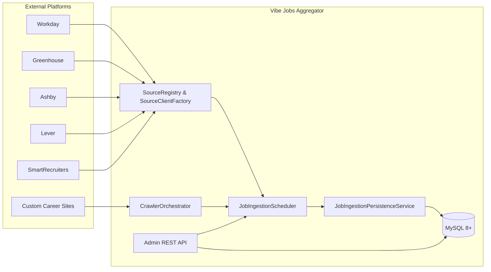
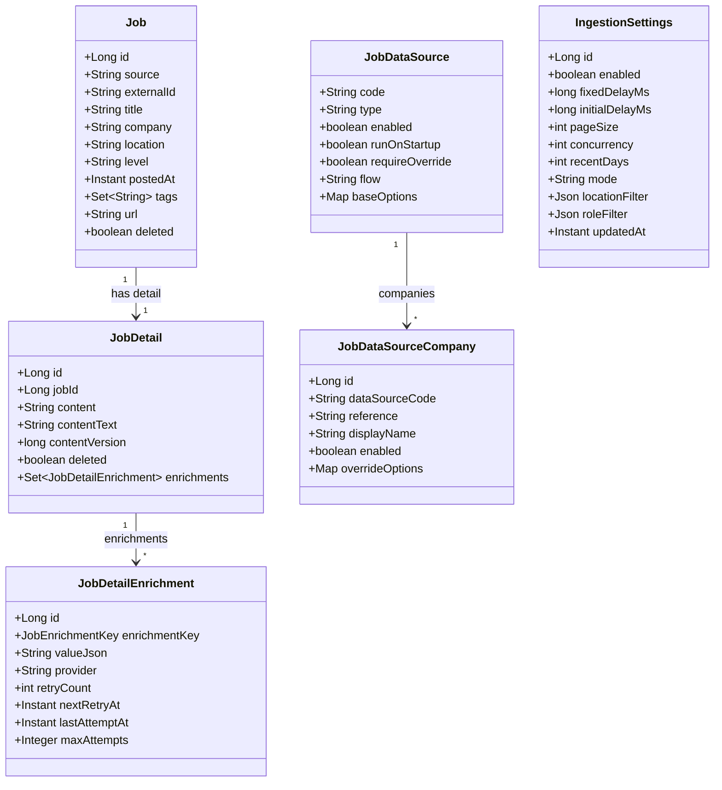
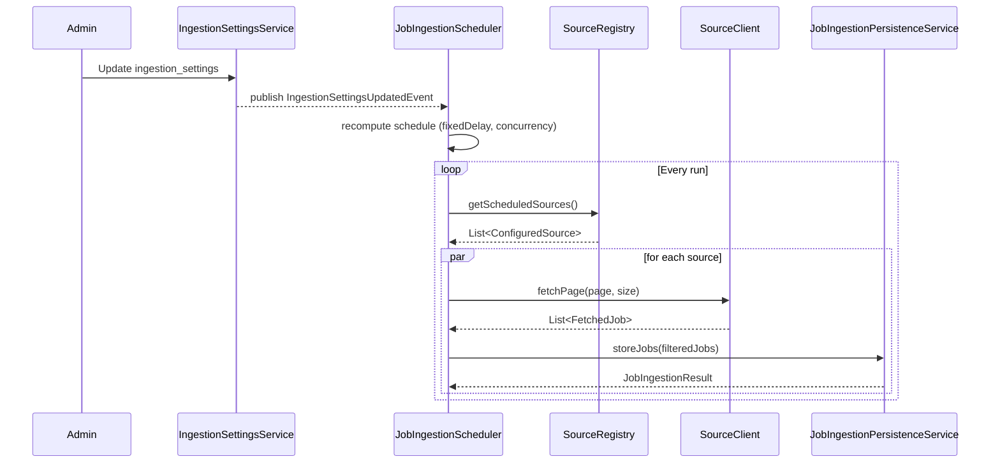
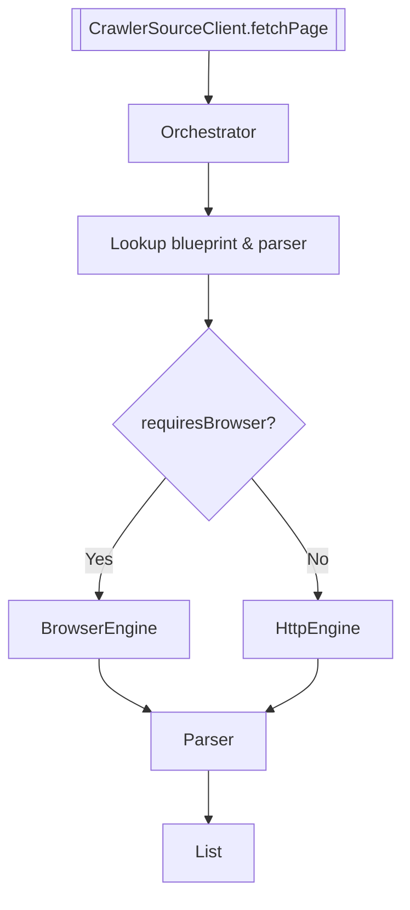
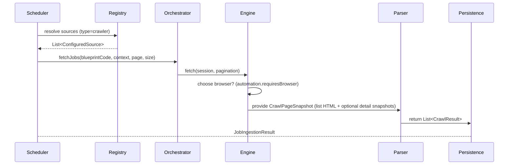

# Vibe Jobs Aggregator

[阅读中文文档 🇨🇳](README.zh-CN.md)

Backend service (Spring Boot 3 / Java 17) that centralises job postings from multiple external platforms, enriches them, and exposes the data to downstream consumers and the admin portal. This document provides a high-level technical overview of the codebase, focusing on the domain model, ingestion pipeline, and operational tooling.

---

## 1. Architecture Overview



The ingestion loop is driven by `JobIngestionScheduler`, which fetches source definitions from the database, resolves the appropriate client (REST API or browser-based crawler), retrieves pages of jobs, filters/enriches the results, and persists them into the `jobs` / `job_details` domain tables. The admin UI interacts with the same APIs (proxied through Next.js) to manage configuration, trigger manual runs, and inspect results.

---

## 1.1 Domain-Driven layering

The codebase follows a hexagonal/DDD layout inside each bounded context:

```text
com/vibe/jobs/<context>/
├── domain/           // Aggregates, value objects, domain services
│   └── spi/          // Output ports (interfaces) consumed by domain/application code
├── application/      // Use cases, schedulers, orchestration logic
├── infrastructure/
│   └── persistence/  // Adapters that implement the ports + JPA entities/mappers
└── interfaces/       // REST controllers, DTOs and other inbound adapters
```

- **Domain aggregates** (`Job`, `JobDetail`, `AuthSession`, …) are persistence-agnostic Java objects. They no longer carry JPA annotations or lifecycle callbacks.
- **Ports** in `domain.spi` declare the persistence contract required by the use cases. For example, `JobRepositoryPort` and `AuthSessionRepositoryPort` expose the queries and mutations needed by the application layer.
- **Infrastructure adapters** translate between aggregates and database entities. Spring Data repositories (`JobJpaRepository`, `AuthSessionJpaRepository`, …) are private to the adapters and must not leak into domain/application code.
- When introducing a new persistence technology (e.g. MyBatis), create another adapter that implements the same port without changing the domain layer.

All contexts (job posting, auth, ingestion, …) should follow this structure going forward.

---

## 2. Core Data Model



### Table highlights

| Table | Purpose |
| ----- | ------- |
| `jobs` | Canonical list of job postings grouped by `company` + `externalId`. Includes high-level metadata, tags, and soft-delete flag. |
| `job_details` | Raw HTML + text content for a posting, including `contentVersion` for optimistic locking. |
| `job_detail_enrichments` | Enrichment snapshots (summary, skills, highlights, structured data, status). Tracks retry scheduling (`retryCount`, `nextRetryAt`, `maxAttempts`). |
| `job_data_source` | Master configuration for each provider (Workday, Greenhouse, crawler blueprint, …). |
| `job_data_source_company` | Per-provider company list (slug + display name + overrides). |
| `ingestion_settings` | Global ingestion cadence, filters, and runtime toggles. Stored as JSON columns to simplify rollouts. |
| `crawler_*` | Blueprint configuration, parser templates, run logs, and cache for browser-driven scraping. |

`IngestionSettingsService` loads the active record, providing the scheduler with runtime parameters (delay, concurrency, location and role filters, etc.). Admin mutations update this table without restarting the service.

---

## 3. Configuration

### 3.1 Ingestion Settings (`ingestion_settings`)

```
ingestion_settings
└─ enabled             // toggles scheduler globally
└─ fixed_delay_ms      // delay between runs
└─ initial_delay_ms    // startup offset
└─ page_size           // max jobs per fetch
└─ concurrency         // concurrent source batches
└─ mode                // companies | recent
└─ recent_days         // used when mode=recent
└─ location_filter     // JSON (include/exclude countries/regions/cities/keywords)
└─ role_filter         // JSON (include/exclude keywords)
```

`JobIngestionScheduler` pulls this snapshot at startup and whenever the admin updates settings. No YAML edits or redeployments are required.

### 3.2 Data Sources

Each record in `job_data_source` describes a provider; `job_data_source_company` supplies provider-specific slugs and overrides. Example (Greenhouse):

```json
{
  "code": "greenhouse",
  "type": "greenhouse",
  "enabled": true,
  "runOnStartup": true,
  "flow": "UNLIMITED",
  "baseOptions": {},
  "companies": [
    {
      "reference": "binance",
      "displayName": "Binance",
      "overrideOptions": { "location": "asia" }
    },
    {
      "reference": "airwallex",
      "displayName": "Airwallex"
    }
  ]
}
```

For crawler blueprints, `baseOptions` must include `blueprintCode`.

---

## 4. Ingestion Workflow

### 4.1 Scheduler sequence



### 4.2 Filtering pipeline

1. Keyword filter (`RoleFilterService`).
2. Location filter (`LocationFilterService` + enhanced selector traversal).
3. Cursor filter to avoid duplicates (per `IngestionCursor`).
4. Persistence (`JobIngestionPersistenceService`) writes `jobs`, `job_details`, and triggers enrichment events.
5. Enrichment writer (`JobDetailEnrichmentWriter`) stores summary/skills/highlights/structured data and handles retries.

### 4.3 Crawler flow



`BrowserCrawlerExecutionEngine` uses Playwright via the session manager; it supports scroll/click flows, wait steps, attribute-based location extraction, and detail fetches.

---

## 5. Crawler Subsystem

### 5.1 Execution Pipeline



The orchestrator loads the `crawler_blueprint` record, resolves a parser profile, and dispatches to either the browser engine (Playwright) or the lightweight HTTP engine. Browser runs are preferred whenever automation requires JavaScript, scroll, or click operations; only if the browser fails will the orchestrator fall back to HTTP.

### 5.2 `crawler_blueprint.config_json`

Each blueprint is stored as JSON. The top-level structure contains the following sections:

| Key | Description |
| --- | ----------- |
| `entryUrl` | Base URL used to load the listing page. Placeholders (e.g. `_locations=china`) can be embedded here. |
| `paging` | Mode (`NONE`, `QUERY`, `OFFSET`, `PATH_SUFFIX`) plus optional parameters (`parameter`, `start`, `step`, `sizeParameter`). Determines how additional pages are fetched. |
| `rateLimit` | Requests-per-minute and burst limits enforced per blueprint. |
| `automation` | Browser automation metadata; `jsEnabled=true` forces Playwright, `waitForMilliseconds` injects delays, `search.fields` can populate form elements. |
| `flow` | Ordered list of crawl steps (WAIT, SCROLL, CLICK, EXTRACT_LIST, EXTRACT_DETAIL, REQUEST). Steps operate on the Playwright page and can capture inline detail HTML. |
| `parser` | Core extraction config (see below). |

Parser configuration contains:

| Field | Purpose |
| ----- | ------- |
| `baseUrl` | Prepended when relative URLs are encountered. |
| `listSelector` | CSS selector that returns all job nodes on the listing page. |
| `fields` | Mapping from logical field (`title`, `url`, `externalId`, `company`, `location`, …) to extraction instructions (`type`, `selector`, `attribute`, `constant`, etc.). |
| `tagFields` | Optional set of fields copied into `jobs.tags`. |
| `descriptionField` | Listing-level description; typically left blank when detail fetch is enabled. |
| `detailFetch` | Controls detail-page scraping: `enabled`, `baseUrl`, `urlField` (usually `url` or `externalId`), optional `delayMs`, and `contentSelectors` that extract the HTML payload. |

Example (Apple China):

```json
{
  "entryUrl": "https://jobs.apple.com/zh-cn/search?team=ENGINEERING&team=FINANCE&_locations=china&_language=zh_CN",
  "paging": {"mode": "QUERY", "parameter": "page", "start": 1, "step": 1},
  "automation": {"enabled": true, "jsEnabled": true, "waitForMilliseconds": 8000},
  "flow": [
    {"type": "WAIT", "options": {"durationMs": 10000}},
    {"type": "SCROLL", "options": {"to": "bottom", "times": 3}},
    {"type": "WAIT", "options": {"durationMs": 5000}},
    {"type": "EXTRACT_DETAIL", "options": {"selector": "a[href*='/zh-cn/details/']", "limit": 40}},
    {"type": "EXTRACT_LIST"}
  ],
  "parser": {
    "baseUrl": "https://jobs.apple.com",
    "listSelector": "li[data-automation-id='jobPosting']",
    "fields": {
      "title": {"type": "TEXT", "selector": "[data-automation-id='jobTitle']"},
      "url": {"type": "ATTRIBUTE", "selector": "a[href*='/details/']", "attribute": "href", "baseUrl": "https://jobs.apple.com"},
      "externalId": {"type": "ATTRIBUTE", "selector": "a[href*='/details/']", "attribute": "href"},
      "company": {"type": "CONSTANT", "constant": "Apple"},
      "location": {"type": "TEXT", "selector": "[data-automation-id='jobLocation']"}
    },
    "detailFetch": {
      "enabled": true,
      "baseUrl": "https://jobs.apple.com",
      "urlField": "url",
      "delayMs": 2000,
      "contentSelectors": ["article", "main section", "div[class*='job-description']"]
    }
  }
}
```

### 5.3 Flow & Detail Parsing

- **EXTRACT_LIST** captures the post-flow HTML for the listing page; selectors defined in `fields` run against this snapshot.
- **EXTRACT_DETAIL** opens each matching anchor in a new Playwright page, waits for `domcontentloaded`, captures the HTML, and passes it to the parser. The parser then:
  1. Builds a detail URL (`baseUrl` + `href`).
  2. Parses structured data (title/location) from detail metadata if present.
  3. Merges detail HTML with listing metadata to produce the final description.
- The parser also normalises URLs, trims whitespace, and guards against non-target locations before attempting detail fetches (e.g. non-China Apple postings are skipped to avoid 404/timeout loops).

### 5.4 Adding a New Crawler Source

1. **Create the blueprint:** prefer the admin generator (`POST /admin/crawler-blueprints`) which accepts entry URL, optional search keywords, and exclusion selectors. The generation manager runs Playwright to infer selectors, paging, and produces a draft JSON plus validation report. For edge cases you can still seed JSON manually via SQL (`crawler_init.sql`).
2. **Register the source:** add a `job_data_source` entry with `type = 'crawler'`, `base_options.blueprintCode`, and optional company overrides.
3. **(Optional) Company overrides:** if the same blueprint serves multiple brands, populate `job_data_source_company` with their slugs and override options (e.g. substitute placeholders in entry URL).
4. **Validate:** trigger a manual ingestion (admin portal `rerun` action or `JobIngestionScheduler`), review the generation report and `crawler_run_log`, and adjust flow/selector overrides if needed before activating in production schedules.

Blueprints can be hot-swapped: updating `config_json` takes effect on the next scheduler run without redeploying the service.

### 5.5 Blueprint Generation Workflow

The automated wizard is backed by several domain services:

1. **Launch** – `AdminCrawlerBlueprintController.create` persists a draft (`crawler_blueprint`) and a pending task (`crawler_blueprint_generation_task`) with sanitized inputs.
2. **Async execution** – `CrawlerBlueprintGenerationManager` dispatches work to the dedicated executor (`crawler.blueprint.generation.executor.*`). Playwright navigates to the entry URL, optionally submits keywords/exclusions, captures HTML/screenshot snapshots, and passes them to `CrawlerBlueprintAutoParser`/`CrawlerBlueprintValidator`.
3. **Draft update** – Successful runs populate `draft_config_json` and `last_test_report_json`; failures retain the report with error/snapshot metadata so operators can rerun after tweaking inputs.
4. **Activation** – `POST /admin/crawler-blueprints/{code}/activate` copies the draft config into `config_json` and upserts a `job_data_source` where `base_options` include `blueprintCode`/`crawlerBlueprintCode`. Audit records are written via `AdminChangeLogService`.

Admin detail endpoints (`GET /admin/crawler-blueprints/{code}`) expose recent tasks, reports, and activation status to support troubleshooting.

---

## 6. Enrichment & Retry Logic

- `JobDetailEnrichmentWriter` updates the `STATUS` enrichment and persists payload enrichments.
- `JobDetailEnrichmentRetryStrategy` computes exponential backoff; `JobDetailEnrichmentRetryScheduler` dispatches retries when `next_retry_at` is due.
- `JobEnrichmentExtractor` now supports both `JobDetail` entities and DTO snapshots, normalising JSON fields into immutable views.

---

## 7. Admin & Automation

### 7.1 Admin Endpoints (excerpt)

| Method | Endpoint | Description |
| ------ | -------- | ----------- |
| GET | `/admin/ingestion-settings` | Inspect global scheduler config |
| PUT | `/admin/ingestion-settings` | Update cadence & filters |
| GET | `/admin/data-sources` | List providers |
| POST | `/admin/data-sources/{code}/companies` | Add company slug to provider |
| DELETE | `/admin/data-sources/{code}/companies/{companyId}` | Remove company |
| POST | `/admin/job-details/normalize-content-text` | Rebuild `content_text` field |

The Next.js frontend forwards requests through `/api/admin/...`, handling session cookies and error propagation.

### 7.2 Daily company enrichment script

`scripts/collect_new_companies.py` checks vendor APIs (Greenhouse, Lever, SmartRecruiters) for engineering & finance roles and outputs a SQL patch under `scripts/job_data_source_company_patch.sql`. Scheduling guidance and configuration details live in [designdocs/daily_company_enrichment.md](designdocs/daily_company_enrichment.md).

---

## 8. Running Locally

### 8.1 Prerequisites

- Java 17
- Maven 3.9+
- MySQL 8.x (or Docker Compose stack)
- Node.js 18+ (for the Next.js admin portal)
- Optional Playwright dependencies (`docker/frontend.Dockerfile` installs them)

### 8.2 Commands

```bash
# Bring up dependencies (MySQL, etc.)
docker compose up -d

# Start the backend
mvn spring-boot:run

# Seed crawler blueprints (optional)
mysql -u vibejobs -pvibejobs vibejobs < scripts/crawler_init.sql
```

To use the embedded H2 profile: `SPRING_PROFILES_ACTIVE=h2 mvn spring-boot:run`.

---

## 9. Monitoring & Troubleshooting

- Scheduler logs use the `job-enrich-` thread prefix; enable `logging.level.com.vibe.jobs=DEBUG` for verbose output.
- `crawler_run_log` stores each blueprint execution (duration, success flag, error message).
- The admin portal displays data source status, company lists, and retry queues.
- Frequent issues:
  - **HTTP 403** from vendor → source temporarily skipped.
  - **Invalid blueprint JSON** → ensure the JSON stored in MySQL is single-line and double-escaped in SQL scripts.
  - **Location filter drops everything** → confirm parser configuration extracts meaningful location text.

---

## 10. References

- [DATA-SOURCES.md](DATA-SOURCES.md) — provider-specific configuration
- `designdocs/` — design notes (crawler architecture, daily enrichment automation, etc.)
- `scripts/` — seed SQL (`crawler_init.sql`) and operational scripts (`collect_new_companies.py`)

---

> Maintainers: Data Platform Team @ Vibe Coding
