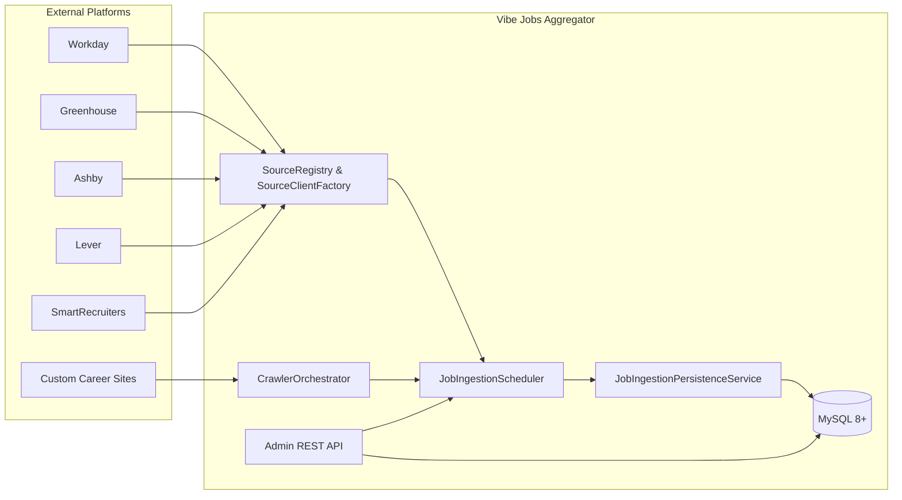
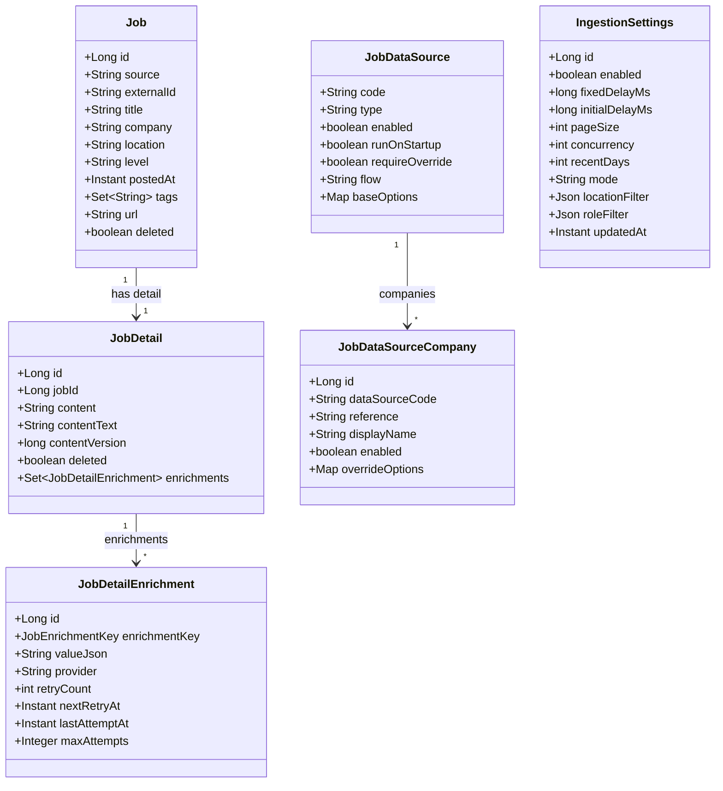

# Vibe Jobs Aggregator

[Read this in English 🇺🇸](README.md)

Vibe Jobs Aggregator 是一个 Spring Boot 3 / Java 17 编写的后端服务，用于聚合外部职位数据、执行 LLM 增强，并向前端与管理端提供统一 API。本文档从架构、领域模型、采集管线到运维工具链提供详细说明，便于工程师快速上手维护。

---

## 1. 架构概览



采集循环由 `JobIngestionScheduler` 驱动：调度器从数据库读取数据源配置，选择合适的客户端（REST API 或浏览器爬虫），批量获取职位，执行过滤与增强，并持久化到 `jobs` / `job_details`。管理端通过同一套 REST API（由 Next.js 转发）执行配置、手动触发、结果查看等操作。

---

## 1.1 分层与端口设计

每个限界上下文都遵循 DDD/六边形架构的目录结构：

```text
com/vibe/jobs/<context>/
├── domain/           // 聚合根、值对象、领域服务
│   └── spi/          // 领域输出端口（接口），供领域/应用层依赖
├── application/      // 用例服务、调度器、编排逻辑
├── infrastructure/
│   └── persistence/  // 适配器实现端口 + JPA 实体与映射
└── interfaces/       // REST 控制器、DTO 等入站适配器
```

- **领域聚合**（如 `Job`、`JobDetail`、`AuthSession` 等）保持为纯 Java 对象，不再直接依赖 JPA 注解或生命周期回调。
- `domain.spi` 下的 **端口接口** 声明了持久化所需的操作，例如 `JobRepositoryPort`、`AuthSessionRepositoryPort`，由应用层通过构造器注入使用。
- **基础设施适配器** 负责在聚合与数据库实体之间转换，内部可以组合 Spring Data 仓储（如 `JobJpaRepository`、`AuthSessionJpaRepository`），但不得向领域/应用层泄露。
- 如需接入新的持久化技术（例如 MyBatis），只需新增实现同一端口的适配器，无需修改领域层代码。

当前所有上下文（jobposting、auth、ingestion 等）均按此规范演进，后续开发保持一致即可。

---

## 2. 核心数据模型



该模型覆盖了职位主体、详情富文本、LLM 增强、数据源管理及调度配置等实体。

---

## 3. 采集管线

1. **SourceRegistry & SourceClientFactory** 根据数据源类型选择 REST 客户端或爬虫客户端。
2. **CrawlerOrchestrator** 对需要浏览器渲染的站点使用 Playwright 采集，支持并发和节流配置。
3. **JobIngestionPersistenceService** 负责去重、详情入库、状态更新与指标记录。
4. **事件驱动增强**：成功入库后发布事件，触发 LLM 增强与通知流程。

---

## 4. LLM 增强
- `JobDetailEnrichmentWriter` 写入 `STATUS` 以及各类结构化增强字段。
- `JobDetailEnrichmentRetryStrategy` 计算指数退避，`JobDetailEnrichmentRetryScheduler` 依据 `next_retry_at` 触发重试。
- `JobEnrichmentExtractor` 同时支持实体与 DTO 快照，保证序列化字段一致性。

---

## 5. Crawler Blueprint

蓝图存储在 `crawler_blueprint` 表中，以 JSON 描述入口、翻页、解析器与详情补抓。以下为 Apple Careers 示例片段：

```json
{
  "entry": {
    "url": "https://jobs.apple.com/en-us/search?location=shanghai-China"
  },
  "paging": {
    "mode": "SCROLL",
    "scroll": {
      "max": 30,
      "waitFor": "button.load-more"
    }
  },
  "flow": {
    "steps": ["WAIT_FOR_NETWORK_IDLE", "EXTRACT_LIST"],
    "detailFlow": ["NAVIGATE", "WAIT_FOR_DOM", "EXTRACT_DETAIL"]
  },
  "parser": {
    "list": {
      "title": {"type": "TEXT", "selector": "[data-automation-id='jobTitle']"},
      "url": {"type": "ATTRIBUTE", "selector": "a[href*='/details/']", "attribute": "href", "baseUrl": "https://jobs.apple.com"},
      "externalId": {"type": "ATTRIBUTE", "selector": "a[href*='/details/']", "attribute": "href"},
      "company": {"type": "CONSTANT", "constant": "Apple"},
      "location": {"type": "TEXT", "selector": "[data-automation-id='jobLocation']"}
    },
    "detailFetch": {
      "enabled": true,
      "baseUrl": "https://jobs.apple.com",
      "urlField": "url",
      "delayMs": 2000,
      "contentSelectors": ["article", "main section", "div[class*='job-description']"]
    }
  }
}
```

- **EXTRACT_LIST** 会对翻页后的 HTML 执行字段选择器。
- **EXTRACT_DETAIL** 打开每个职位详情页，等待 `domcontentloaded`，抓取完整 HTML 并解析结构化字段。
- 支持多品牌共用蓝图，只需在 `job_data_source_company` 中配置覆盖项。

---

## 6. 运维与自动化

### 6.1 管理端 API（节选）

| Method | Endpoint | 说明 |
| ------ | -------- | ---- |
| GET | `/admin/ingestion-settings` | 查看全局调度配置 |
| PUT | `/admin/ingestion-settings` | 更新采集节奏与过滤器 |
| GET | `/admin/data-sources` | 列出所有数据源 |
| GET | `/admin/data-sources/{code}` | 通过 `code` 查看单个数据源 |
| GET | `/admin/data-sources/by-id/{id}` | 通过主键查看单个数据源 |
| GET | `/admin/data-sources/{code}/paged` | 携带分页信息返回公司列表 |
| POST | `/admin/data-sources` | 创建数据源 |
| PUT | `/admin/data-sources/{id}` | 更新数据源 |
| DELETE | `/admin/data-sources/{id}` | 删除数据源 |
| POST | `/admin/data-sources/bulk` | 批量创建数据源 |
| POST | `/admin/data-sources/{code}/companies` | 为数据源新增公司 |
| POST | `/admin/data-sources/{code}/companies/bulk` | 批量添加公司覆盖配置 |
| PUT | `/admin/data-sources/{code}/companies/{companyId}` | 更新公司覆盖配置 |
| DELETE | `/admin/data-sources/{code}/companies/{companyId}` | 删除公司覆盖配置 |
| POST | `/admin/data-sources/{id}/cleanup-duplicates` | 清理重复的公司记录 |
| POST | `/admin/crawler-blueprints` | 触发 Playwright 自动生成爬虫蓝图草稿 |
| POST | `/admin/job-details/normalize-content-text` | 重建 `content_text` 字段 |

Next.js 前端通过 `/api/admin/...` 代理上述请求，处理会话与错误。

### 6.2 日常公司补全脚本

日常公司补全工具已迁移至 [`scripts/companies/`](scripts/companies/)。通过 `validate_ats_sources.py` 校验各 ATS（如 Greenhouse、Lever、SmartRecruiters）返回的职位数量，结合 `company_candidates.yml` 生成新的 `job_data_source_company_patch.sql`。调度建议与参数详见 [`docs/design-docs/daily_company_enrichment.md`](docs/design-docs/daily_company_enrichment.md)。

### 6.3 爬虫蓝图自动生成流程

1. **发起向导**：在管理端 “爬虫蓝图” 页面或调用 `POST /admin/crawler-blueprints`，填写 `code`、`name`、`entryUrl`，可选输入搜索关键词与忽略选择器。
2. **异步执行**：`CrawlerBlueprintGenerationManager` 将任务派发到独立线程池（`crawler.blueprint.generation.executor.*`），使用 Playwright 抓取 HTML/截图后交由自动解析器与校验器生成字段选择器、分页策略与测试报告。
3. **草稿审阅**：成功时 `crawler_blueprint` 草稿会写入 `draft_config_json` 与 `last_test_report_json`；失败时保存错误与快照，可通过 `POST /admin/crawler-blueprints/{code}/rerun` 调整参数后重试。
4. **激活上线**：确认草稿状态为 `READY` 后，调用 `POST /admin/crawler-blueprints/{code}/activate` 将配置转正写入 `config_json`，并同步创建/更新 `job_data_source`（`base_options` 会填充 `blueprintCode` 与 `crawlerBlueprintCode`）。

管理端详情接口 (`GET /admin/crawler-blueprints/{code}`) 会展示最近任务、测试报告与激活时间，便于追溯与排障。

---

## 7. 本地运行

### 前置条件
- Java 17
- Maven 3.9+
- MySQL 8.x（或使用 Docker Compose 提供的依赖）
- Node.js 18+（用于管理端 Next.js 应用）
- 可选：Playwright 依赖（`docker/frontend.Dockerfile` 已包含）

### 常用命令

```bash
# 启动依赖（MySQL 等）
docker compose up -d

# 启动后端
mvn spring-boot:run

# 可选：初始化爬虫蓝图
mysql -u vibejobs -pvibejobs vibejobs < scripts/crawler_init.sql
```

若需使用内置 H2，可执行：`SPRING_PROFILES_ACTIVE=h2 mvn spring-boot:run`。

---

## 8. 监控与排障
- 调度日志前缀 `job-enrich-`，如需更详细日志可设置 `logging.level.com.vibe.jobs=DEBUG`。
- `crawler_run_log` 记录每次蓝图执行（耗时、成功标记、错误信息）。
- 管理端提供数据源状态、公司列表、重试队列等视图。
- 常见问题：
  - **HTTP 403**：供应商拒绝访问，任务将暂时跳过。
  - **蓝图 JSON 非法**：确保写入 MySQL 的 JSON 为单行、双引号转义正确。
  - **位置过滤过严**：确认解析配置能提取有效的地点文本。

---

## 9. 参考资料
- [DATA-SOURCES.md](DATA-SOURCES.md) — 各数据源配置说明
- [`docs/design-docs/daily_company_enrichment.md`](docs/design-docs/daily_company_enrichment.md) — 公司补全自动化设计说明
- [`scripts/crawler_init.sql`](scripts/crawler_init.sql) — 爬虫蓝图初始化 SQL
- [`scripts/companies/`](scripts/companies/) — 公司补全 YAML、校验脚本与 SQL 输出

---

> 维护者：Vibe Coding 数据平台团队
