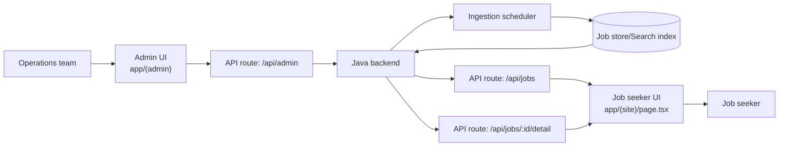
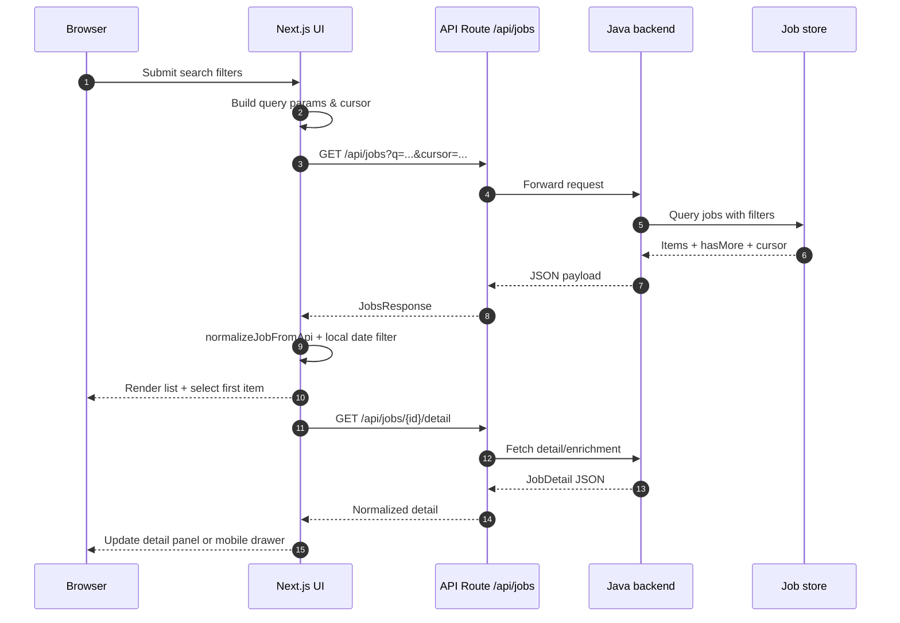

# Vibe Jobs View

[阅读中文文档 🇨🇳](README.zh-CN.md)

Vibe Jobs View is the Next.js front-end for the Vibe Jobs talent intelligence platform. It focuses on job discovery, AI-enriched job detail rendering, and an operations console for controlling data ingestion pipelines.

## Table of contents
- [Overview](#overview)
- [Tech stack](#tech-stack)
- [Getting started](#getting-started)
- [System architecture](#system-architecture)
- [Core business flow](#core-business-flow)
- [Interaction sequence](#interaction-sequence)
- [Domain models](#domain-models)
- [Feature modules](#feature-modules)
- [Runtime configuration](#runtime-configuration)
- [Admin console](#admin-console)
- [Front-end behaviors](#front-end-behaviors)
- [Development & testing](#development--testing)

## Overview
- Job seeker experience built with the Next.js App Router, delivering instant filters, infinite scroll, and smart job detail enrichment.
- Email magic-link authentication flow with challenge verification and cookie-based session handling.
- Operations console for tuning ingestion cadence, source throttling, and agency/company whitelists.
- Internationalization (Chinese/English) and mobile-friendly UX, including pull-to-refresh and detail drawer.

## Tech stack
- Next.js 14 App Router + TypeScript + React 18.
- Tailwind CSS design tokens plus custom UI kit under `components/ui` and `vibe-jobs-ui-pack`.
- TanStack React Query v5 for caching, mutations, auth/session fetching, and admin data refresh.
- Date-fns + date-fns-tz for timeline rendering.
- Jest + Testing Library ready for component tests (no suites committed yet).

## Getting started
```bash
pnpm install
pnpm dev # http://localhost:3000
```

Recommended Node.js ≥ 18. Configure backend connectivity with environment variables described in [Runtime configuration](#runtime-configuration).

## System architecture
The front-end relies on the Vibe Jobs Java backend for search, enrichment, and admin orchestration. API Routes under `app/api/*` bridge the browser and the backend, handling proxy, normalization, and authentication cookies.



## Core business flow
1. Administrators adjust ingestion cadence, data source switches, and quotas through the admin UI. Changes are persisted via `/api/admin/*` routes and trigger immediate backend rescheduling.
2. Crawlers ingest new postings into the central job store. Successful enrichment updates status flags that surface downstream.
3. Job seekers land on the site UI, submit filters, and fetch paginated jobs from `/api/jobs`. Client-side code normalizes responses, applies date filtering, and pre-selects the first result.
4. Selecting a job triggers a detail fetch from `/api/jobs/:id/detail`; enrichment metadata controls whether AI summaries/skills/highlights are shown.
5. Authentication flows issue session cookies (`vj_session`) so subsequent admin and personalized requests can be authorized transparently.

## Interaction sequence


## Domain models
| Model | File | Key fields |
| --- | --- | --- |
| `Job` | `lib/types.ts` | `id`, `title`, `company`, `location`, `level`, `postedAt`, `tags`, `summary`, `skills`, `highlights`, `structuredData`, `enrichmentStatus` |
| `JobDetail` | `lib/types.ts` | Mirrors `Job` plus raw `content`, enrichment metadata, optional structured JSON blob |
| `JobsResponse` | `lib/types.ts` | `items: Job[]`, `total`, `nextCursor`, `hasMore`, `size` |
| `JobsQuery` | `lib/types.ts` | Search filters propagated to the backend (`q`, `location`, `company`, `level`, `cursor`, `size`) |

Normalization happens in `lib/jobs-normalization.ts`, ensuring enrichment data is only exposed after the backend reports a `SUCCESS` state.

## Feature modules
- `app/(site)` — marketing shell and job discovery experience with hero search, filter drawer, intersection-observer pagination, and mobile detail drawer.
- `app/api/jobs` — stateless proxy connected to the backend `/api/jobs`, returning validated JSON or 502 on malformed payloads.
- `components/JobDetail` — sanitizes HTML content, merges enrichment fields, and renders summary/skills/highlights with graceful fallbacks.
- `lib/i18n.tsx` — lightweight internationalization provider with localStorage persistence and `<LanguageSwitcher />` integration.
- `app/(auth)` — email challenge flow across `LoginStepEmail` and `LoginStepVerify`, leveraging `/api/auth/request-code` and `/api/auth/verify-code` routes.
- `app/(admin)/admin` — ingestion configuration, data source CRUD, and bulk upload tooling (JSON-based) for company whitelists.

## Runtime configuration
Environment variables control which backend the UI proxies to:

| Variable | Default | Purpose |
| --- | --- | --- |
| `BACKEND_BASE_URL` | `undefined` | Preferred at runtime (server-side). Full URL to the Java backend root; `/api` is appended automatically. |
| `NEXT_PUBLIC_BACKEND_BASE` | `/api` | Browser fallback for API routes when `BACKEND_BASE_URL` is not set. Accepts absolute URL, `/api` path, or protocol-relative value. |
| `NEXT_PUBLIC_API_BASE` | `/api` | Secondary fallback for legacy setups; also used by client-side fetches in `app/(site)/page.tsx`. |

When running locally with the Java backend on `localhost:8080`:
```bash
BACKEND_BASE_URL="http://localhost:8080" pnpm dev
```
Docker deployments commonly set `BACKEND_BASE_URL="http://backend:8080"` so both API routes and client fetches resolve inside the container network.

## Admin console
- **Ingestion settings** (`app/(admin)/admin/ingestion-settings/page.tsx`): adjust delay, concurrency, page size, and JSON-based location/role filters. Saves trigger invalidation via React Query.
- **Data sources** (`app/(admin)/admin/data-sources/page.tsx`): maintain source definitions, category quota definitions, and company overrides; includes JSON editors and bulk upload modals (`components/admin/DataSourceBulkUpload`, `CompanyBulkUpload`).
- **Dashboard landing** (`app/(admin)/admin/page.tsx`): quick links plus operational tips. All admin screens expect an authenticated session.

Admin routes proxy to the backend via `app/api/admin/*` for create/update/delete operations and enforce consistent JSON responses.

## Front-end behaviors
- **React Query caching**: `app/providers.tsx` wires a shared `QueryClient` for job detail fetching, auth session polling, and admin mutations.
- **Infinite scroll + observer**: job list uses an `IntersectionObserver` anchored at `loadMoreRef` with mobile-friendly fallbacks (debounced scroll + pull-to-refresh touch handlers).
- **Detail enrichment gating**: UI shows AI summaries, skills, and highlights only when `enrichmentStatus.state === 'SUCCESS'`; pending/failed states surface subtle banners.
- **Responsive UX**: viewport watcher toggles between desktop split layout and mobile full-screen drawer, preserving selection state.
- **Internationalization**: initial language auto-detected from browser, persisted in `localStorage`, and synchronized to `<html lang>`.
- **Authentication**: `AuthProvider` wraps the tree, fetching `/api/auth/session` and broadcasting login/logout state to header menu and admin routes.

## Development & testing
- `pnpm dev` — start local Next.js server.
- `pnpm build && pnpm start` — production build + serve.
- `pnpm lint` — run ESLint (Next.js config).
- Jest + Testing Library are configured; add suites under `__tests__` or alongside components as needed.

Before pushing changes, ensure lint passes and that critical flows (search, detail view, admin edits) work against the intended backend environment.