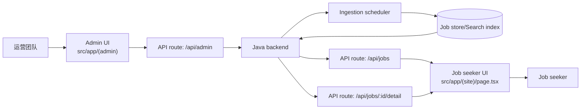
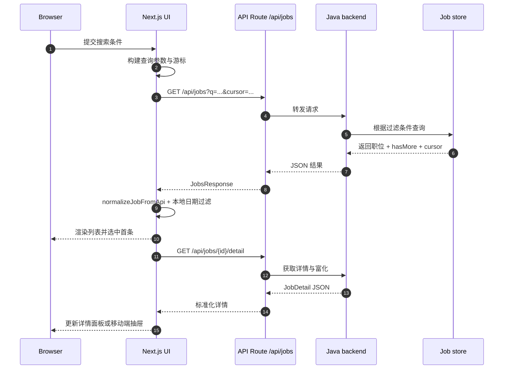

# Vibe Jobs View

[Read this in English 🇺🇸](README.md)

Vibe Jobs View 是 Vibe Jobs 人才情报平台的 Next.js 前端，提供职位搜索体验、AI 富化的详情渲染以及运营后台。本文件介绍架构、业务流程、模块划分与本地开发方法。

## 目录
- [概览](#概览)
- [技术栈](#技术栈)
- [快速开始](#快速开始)
- [系统架构](#系统架构)
- [核心业务流程](#核心业务流程)
- [交互时序](#交互时序)
- [领域模型](#领域模型)
- [功能模块](#功能模块)
- [运行时配置](#运行时配置)
- [管理控制台](#管理控制台)
- [前端行为说明](#前端行为说明)
- [开发与测试](#开发与测试)

## 概览
- 基于 Next.js App Router 构建的职位搜索体验，支持即时过滤、无限滚动以及 AI 详情增强。
- 邮件魔法链接登录，包含验证码校验与 Cookie 会话管理。
- 运营控制台用于调整采集节奏、数据源限流以及公司白名单。
- 支持中英文切换与移动端友好交互（下拉刷新、详情抽屉）。

## 技术栈
- Next.js 14 App Router + TypeScript + React 18。
- Tailwind CSS 设计令牌与 `src/shared/ui`、`vibe-jobs-ui-pack` 自研组件库。
- TanStack React Query v5 负责缓存、变更、认证与后台数据刷新。
- date-fns 与 date-fns-tz 处理时间线渲染。
- Jest + Testing Library 已配置，可按需补充测试。

## 快速开始
```bash
pnpm install
pnpm dev # http://localhost:3000
```

推荐 Node.js 版本 ≥ 18。后端连接配置见 [运行时配置](#运行时配置)。

## 项目结构
```
src/
  app/           # App Router 路由、布局与全局 Provider
  modules/       # 业务模块（职位搜索、后台、认证）的组件、服务与 hooks
  shared/        # 通用 UI 与工具库
__tests__/      # Jest + Testing Library 测试用例
```

## 系统架构
前端依赖 Java 后端提供搜索、富化与管理能力。`src/app/api/*` 下的 API Route 负责代理浏览器请求、标准化响应并处理认证 Cookie。



## 核心业务流程
1. 管理员在后台调整采集节奏、数据源开关和配额。修改通过 `/api/admin/*` 持久化，并触发后端重新调度。
2. 爬虫持续向数据仓写入新职位。富化成功后更新状态位，供下游消费。
3. 求职者在站点输入筛选条件，前端调用 `/api/jobs` 获取分页数据，本地归一化后渲染列表并默认选中首条。
4. 选择职位会调用 `/api/jobs/:id/detail`，根据富化状态展示 AI 摘要、技能与亮点。
5. 登录流程通过 `/api/auth/request-code` 与 `/api/auth/verify-code` 下发会话 Cookie（`vj_session`），供后续请求复用。

## 交互时序


## 领域模型
| 模型 | 文件 | 关键字段 |
| --- | --- | --- |
| `Job` | `src/modules/job-search/types/jobs.ts` | `id`、`title`、`company`、`location`、`level`、`postedAt`、`tags`、`summary`、`skills`、`highlights`、`structuredData`、`enrichmentStatus` |
| `JobDetail` | `src/modules/job-search/types/jobs.ts` | 在 `Job` 基础上包含 `content`、富化元数据与结构化 JSON |
| `JobsResponse` | `src/modules/job-search/types/jobs.ts` | `items: Job[]`、`total`、`nextCursor`、`hasMore`、`size` |
| `JobsQuery` | `src/modules/job-search/types/jobs.ts` | 透传给后端的检索条件（`q`、`location`、`company`、`level`、`cursor`、`size` 等） |

`src/modules/job-search/utils/jobs-normalization.ts` 负责归一化响应，仅在富化状态为 `SUCCESS` 时暴露 AI 字段。

## 功能模块
- `src/app/(site)` — 营销外壳与职位发现体验，含搜索、筛选抽屉、IntersectionObserver 分页与移动详情抽屉。
- `src/modules/job-search` — 列表/详情组件、服务与 hooks（`useJobList`、`useJobDetail`）协调分页与富化合并。
- `src/app/api/jobs` — 无状态代理 `/api/jobs`，输出校验后的 JSON，异常时返回 502。
- `src/shared/lib/i18n.tsx` — 轻量化 i18n Provider，支持 localStorage 与 `<LanguageSwitcher />`。
- `src/modules/auth` — 邮件挑战流程组件与服务，封装 `/api/auth/*` 的 hooks。
- `src/modules/admin` — 调度配置、数据源 CRUD 与批量导入，基于 React Query 封装服务层。

## 运行时配置
下表列出主要环境变量：

| 变量 | 默认值 | 作用 |
| --- | --- | --- |
| `BACKEND_BASE_URL` | `undefined` | 服务端首选配置，会自动拼接 `/api`。|
| `NEXT_PUBLIC_BACKEND_BASE` | `/api` | 浏览器端代理后端的地址，支持绝对 URL、`/api` 路径或协议相对值。|
| `NEXT_PUBLIC_API_BASE` | `/api` | 兼容旧配置的备选项，客户端请求也会使用，主要用于 `src/app/(site)/page.tsx`。|

本地连接后端示例：
```bash
BACKEND_BASE_URL="http://localhost:8080" pnpm dev
```
Docker 部署通常设置 `BACKEND_BASE_URL="http://backend:8080"`，保证容器网络内可达。

## 管理控制台
- **Ingestion settings** (`src/app/(admin)/admin/ingestion-settings/page.tsx`): 调整延迟、并发、分页以及 JSON 过滤条件，保存后触发 React Query 失效。
- **Data sources** (`src/app/(admin)/admin/data-sources/page.tsx`): 维护数据源定义、分类配额与公司覆盖，包含 JSON 编辑器与批量导入弹窗（`src/modules/admin/components/DataSourceBulkUpload`、`CompanyBulkUpload`）。
- **Dashboard landing** (`src/app/(admin)/admin/page.tsx`): 提供快速入口与运营提示。所有后台页面都要求已认证会话。

后台路由通过 `src/app/api/admin/*` 与后端交互，统一处理 JSON 响应与错误。

## 前端行为说明
- **React Query 缓存**：`src/app/providers.tsx` 中注入共享 `QueryClient`，用于职位详情、会话轮询与后台操作。
- **无限滚动**：职位列表利用 `IntersectionObserver` 与触摸兜底逻辑（防抖滚动 + 下拉刷新）。
- **详情富化控制**：仅当 `enrichmentStatus.state === 'SUCCESS'` 时展示 AI 摘要/技能/亮点，其他状态显示提示。
- **响应式体验**：根据视口切换桌面分栏与移动抽屉，保持选中状态一致。
- **认证**：`AuthProvider` 包裹应用树，拉取 `/api/auth/session` 并同步登录态到头部菜单与后台页面。

## 开发与测试
- `pnpm dev` — 启动本地 Next.js 服务。
- `pnpm build && pnpm start` — 生产构建与启动。
- `pnpm lint` — 运行 ESLint（Next.js 规则集，覆盖 `src/` 与 `__tests__/`）。
- `pnpm test` — 执行基于 Jest + Testing Library 的单元测试（hooks、服务、工具）。

提交前请确保 lint 通过，并验证核心流程（搜索、详情、后台配置）在目标后端环境中可用。
